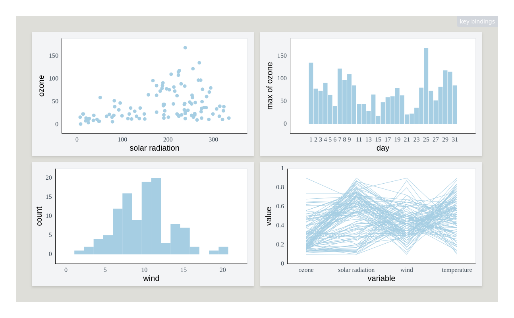

<!-- README.md is generated from README.Rmd. Please edit that file -->

# Plotscaper

<!-- badges: start -->
<!-- badges: end -->

Plotscaper is an R package designed for making interactive figures for
data exploration. All plots in `plotscaper` support linked selection by
default, as well as wide variety of other interactions, including,
zooming, panning, reordering, and parameter manipulation.

The package powering `plotscaper` figures
([plotscape](https://github.com/bartonicek/plotscape)) is written in
(mostly) vanilla TypeScript/JavaScript and uses no external
dependencies/framework for reactivity.

## Quick start

To get started, install `plotscaper` with:

``` r
devtools::install_github("bartonicek/plotscaper")
```

Next, open up RStudio and run the following code:

``` r
library(plotscaper)

names(airquality) <- c("ozone", "solar radiation", "wind", 
                       "temperature", "month", "day")

create_schema(airquality) |>
  add_scatterplot(c("solar radiation", "ozone")) |>
  add_barplot(c("day", "ozone"), list(reducer = "max")) |>
  add_histogram(c("wind")) |>
  add_pcoords(names(airquality)[1:4]) |>
  render()
#> Warning in create_schema(airquality): Removed 42 rows with missing values from
#> the data
```



In your viewer, you should now see something like the (static) image
above, however, your version should be fully interactive. Try clicking
and dragging the scatterplot to select a few points!

Alternatively, to see a fully interactive version of the figure online,
go to one of the vignettes such as [Get
started](articles/plotscaper.html).

(the image above is just a static snapshot because Github doesn’t allow
JavaScript in `README.md`. The other vignettes are full HTML files
rendered with RMarkdown and do support JavaScript as a result)
