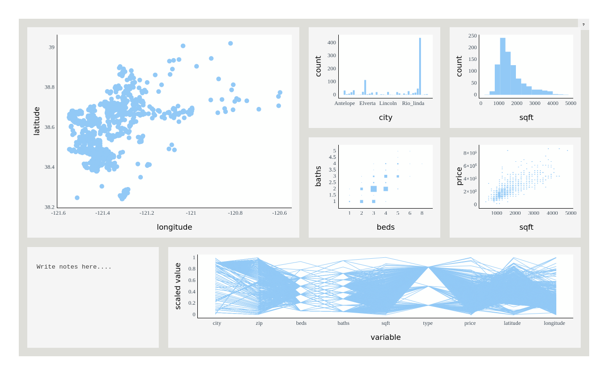

<!-- README.md is generated from README.Rmd. Please edit that file -->

# Plotscaper

<!-- badges: start -->
<!-- badges: end -->

Plotscaper is an R package designed for making interactive figures
geared towards data exploration. All plots in `plotscaper` figures
support linked selection, as well as wide variety of other interactions,
including parameter manipulation, zooming, panning, reordering, and
others.

## Quick start

To get started, install `plotscaper` with:

``` r
devtools::install_github("bartonicek/plotscaper")
```

Next, open up RStudio and run the following code:

``` r
library(plotscaper)

layout <- matrix(c(
  1, 1, 2, 3,
  1, 1, 4, 5,
  6, 7, 7, 7
), ncol = 4, byrow = TRUE)

set_scene(sacramento) |>
  add_scatterplot(c("longitude", "latitude")) |>
  add_barplot("city") |>
  add_histogram(c("sqft")) |>
  add_fluctplot(c("beds", "baths")) |>
  add_histogram2d(c("sqft", "price")) |>
  add_notes() |>
  add_parcoords(names(sacramento)) |>
  set_layout(layout)
```



In your viewer, you should now see something like the image above,
however, your version should be fully interactive (Github doesn’t allow
JavaScript in `README.md`, hence why the image above is static). Try
clicking and dragging on the plot!
