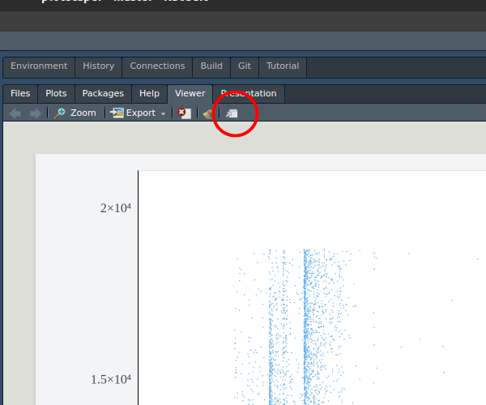

<!-- README.md is generated from README.Rmd. Please edit that file -->

# Plotscaper

<!-- badges: start -->
<!-- badges: end -->

Plotscaper is an R package designed for making interactive figures
geared towards data exploration. All plots in a `plotscaper` figure
support linked highlighting by default, and include a wide variety of
other interactions, including switching representation, changing
parameters, zooming, panning, and reordering.

## Quick start

To get started, install `plotscaper` with:

``` r
devtools::install_github("bartonicek/plotscape/packages/plotscaper")
```

Next, open up RStudio and run the following code:

``` r
library(plotscaper)

layout <- matrix(c(
  1, 1, 2, 3,
  1, 1, 4, 5,
  6, 7, 7, 7
), ncol = 4, byrow = TRUE)

set_scene(sacramento) |>
  add_scatterplot(c("longitude", "latitude")) |>
  add_barplot("city") |>
  add_histogram(c("sqft")) |>
  add_fluctplot(c("beds", "baths")) |>
  add_histogram2d(c("sqft", "price")) |>
  add_notes() |>
  add_parcoords(names(sacramento)) |>
  set_layout(layout)
```


In your viewer, you should now see something like the image above,
however, your version should be fully interactive (the above image is a
static snapshot is because `README.md` does not allow JavaScript,
unfortunately).

Try moving your mouse somewhere over the big scatterplot on the top
left, clicking and dragging to select some points. You should see the
corresponding cases highlight across all the other plots!

There are many other ways interacting with `plotscaper` figures. The
list includes:

- Assigning selected cases to persistent groups
- Changing the size of objects
- Increasing/decreasing the opacity (alpha)
- Panning
- Manipulating parameters such as histogram binwidth and anchor
- Modifying continuous axis limits
- Sorting and reordering discrete axes
- Changing the size of the individual plots

Click on the question mark in the top right of the figure to see the
list plus the corresponding key/mouse bindings.

## Anatomy of a `plotscaper` figure

There are quite a few things happening in the code of the figure above.
Let’s break it down piece by piece.

First, whenever we want to create a `plotscaper` figure, we need to set
up a scene. A scene is a kind of context into which all plots get
placed.

To set up a scene, run:

``` r
set_scene(data = sacramento)
```

where `data` is a `data.frame` object. Here we’re using the Sacramento
housing dataset from the `caret` package.

On its own, however, a scene doesn’t do anything. To create an
interactive figure, we need to populate it with plots. That’s what the
various `add_*plot` functions are for:

``` r
set_scene(sacramento) |>
  add_scatterplot(c("longitude", "latitude")) |>
  add_barplot("city")
```


As you can see above, this creates a simple interactive figure with a
scatterplot and a barplot. Not much more to it. We specify which
variables we want to plot by a simple character vector of their names.

Each `plotscaper` figure is a `htmlwidgets` widget, which means that,
whenever we print the underlying object, `htmlwidgets` generates and
packages up the underlying HTML and sends it to the RStudio viewer
(which is a kind of Web browser). Thus, if we do something like this,
nothing happens:

``` r
s <- set_scene(sacramento) |>
  add_scatterplot(c("longitude", "latitude")) |>
  add_barplot("city")
```

However, printing the `s` object generates the figure:

``` r
s
```


We can use this fact to generate figures programmatically using R. For
example, here’s how we could create an interactive scatterplot matrix
(SPLOM) of the `Iris` dataset:

``` r

iris_smaller <- iris[, 1:3]
keys <- names(iris_smaller)

s <- set_scene(iris_smaller)

for (i in 1:3) {
  for (j in 1:3) {
    # Add a scatterplot if row & column no.'s different
    if (i != j) s <- s |> add_scatterplot(c(keys[i], keys[j]))
    # Add a histogram if row & column no.'s match
    else s <- s |> add_histogram(c(keys[i])) 
  }
}

s
```


### Layout

We can control the figure layout by using the `set_layout` function.
This works similar to the `layout` function from the `graphics` package.
We give it a matrix of numeric values representing the plot ids, and the
figure automatically resizes the plots based on how many equal-sized
rectangles in a grid each plot takes up.

Here’s how we can create a figure with large scatterplot on the
top-left, a tall histogram on the right-hand side, a short wide
histogram on the bottom, and a small section for notes (not-(e)-plot,
pardon the pun) on the bottom-right:

``` r

layout <- matrix(c(
  1, 1, 2,
  1, 1, 2,
  3, 3, 4
), ncol = 3, byrow = TRUE)

set_scene(sacramento) |>
  add_scatterplot(c("sqft", "price")) |>
  add_histogram("price") |>
  add_histogram("sqft") |>
  add_notes() |>
  set_layout(layout)
```


(it doesn’t matter in which order we call the `add_*` and `set_layout`
function, as all the important stuff happens when the HTML for the
figure gets generated)

The individual plots can still be resized by pressing and holding the
`S` key and then dragging a widget in the bottom right of the plot area.
Note however that this may result in gaps in the layout.

## Performance

While `plotscaper` wasn’t designed specifically for performance, it can
perform fairly well on moderately-sized datasets (thanks largely to the
work of the super smart people who optimize the JavaScript engines like
V8, rather than any real ability on my part).

For example, if you want to put it to a stress test, try creating a
figure with the entire `diamonds` dataset from the `ggplot2` package:

``` r
set_scene(ggplot2::diamonds) |>
  add_scatterplot(c("carat", "price")) |>
  add_fluctplot(c("cut", "color")) |>
  add_barplot(c("color"))
```


With 50,000 cases, dragging to select points in the scatterplot becomes
a bit sluggish on my machine, but still fast enough to give the figure
an “interactive” rather than “slideshow” feel. Your mileage may vary.
Note that most of the slowdown is due to rendering rather than
computation - removing the scatterplot with its 50,000 points makes the
interactions a lot snappier.

Also, frustratingly, there seems to be a small slowdown when interacting
with the figure in the RStudio viewer panel rather than in the browser
window. Interestingly, this does not seem to be related to the dataset
size. I’m not very familiar with the RStudio internals and have no idea
why this might be, but for now, if you want faster interactions I
recommend just opening up a browser window, e.g. by clicking the icon in
the top right of the viewer:



(if you know the reason behind this slowdown, please email me at
<abar435@aucklanduni.ac.nz>)

Anyway, if you need fast figures with larger datasets, I recommend:

- Run the figure in the browser rather than viewer
- Use plots which summarize the data (e.g. barplots, 2D histograms),
  rather than plots which show all of the datapoints
- If everything else fails, subsample the data
