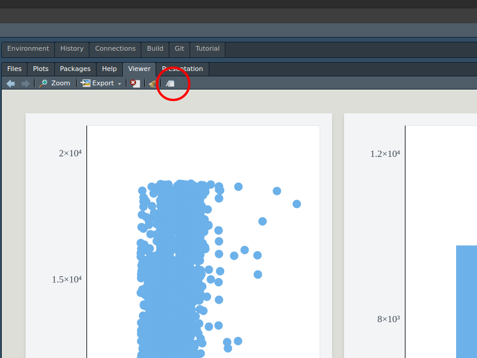

```{r, include = FALSE}
knitr::opts_chunk$set(
  collapse = TRUE,
  fig.width = 6.5,
  fig.height = 4,
  comment = "#>")
```

While performance wasn't a number one concern for me when writing `plotscaper`, I found it can actually perform fairly well on moderately-sized data sets (thanks largely to the work of the very smart people who have optimized JavaScript engines like V8). 

If you want to put `plotscaper` under a stress test, try creating a figure with the entire `diamonds` dataset from the `ggplot2` package:

(the figure below might take a bit to load, please be patient)

```{r}
library(plotscaper)

url <- "https://raw.githubusercontent.com/bartonicek/plotscape/master/datasets/diamonds.json"

create_schema(url) |>
  add_scatterplot(c("carat", "price")) |>
  add_barplot(c("color")) |>
  set_scale("plot1", "size", mult = 0.1) |>
  render()
```

On my machine, I found that, with 50,000 cases, the figure does get a bit sluggish, but still fast enough to feel "interactive" rather than a "slideshow". Your mileage may vary.

Note that most of the slowdown is due to having to render every single point, rather than any kind of computation. This is why scatteplots and parallel coordinate plots are inherently slower than other plot types. If instead you only use plots which show aggregate summaries of the data, (e.g. barplot, histogram, fluctuation diagram, etc...) then interactions like linked selection should be a lot snappier.

Finally, one thing that's frustrating is that there seems to be a small slowdown when interacting with the figure in the RStudio Viewer rather than directly in the browser (Chrome). This does not seem to be related to the data set size. I'm not super familiar with the RStudio internals and have no idea why this might be (if you do, please email me/post on Github), but for now, if you want snappier interactions I recommend just opening up a browser window, e.g. by clicking the icon in the top right of the viewer:

```{r}
#| echo: false
#| eval: false
library(screenshot)
library(magick)

url <- "https://raw.githubusercontent.com/bartonicek/plotscape/master/datasets/diamonds.json"

# Code to take the screenshot of the current page
create_schema(url) |>
  add_scatterplot(c("carat", "price")) |>
  add_barplot(c("color")) |>
  set_scale("plot1", "size", mult = 0.1) |>
  render()

sc <- screenshot()
image <- image_read(sc)
image2 <- image_crop(image, geometry_area(600, 500, 1125, 50))
image3 <- image_draw(image2)
points(290, 140, cex = 10, col = "red", lwd = 5)
dev.off()

image_write(image3, "./man/figures/browser.png")
```

```{r}
#| echo: false

```

(the one downside of this option is that you lose the ability to communicate with the R session, this also means all of your logic has to go before call to `render()`)

Anyway, if you're visualizing big data sets and find your figures are getting slow, I recommend taking some of the following steps:

- Run the figure in the browser rather than the RStudio viewer
- Use plots which show aggregate summaries of the data (e.g. barplots, 2D histograms)
- Take a random sample of the data and visualize that
